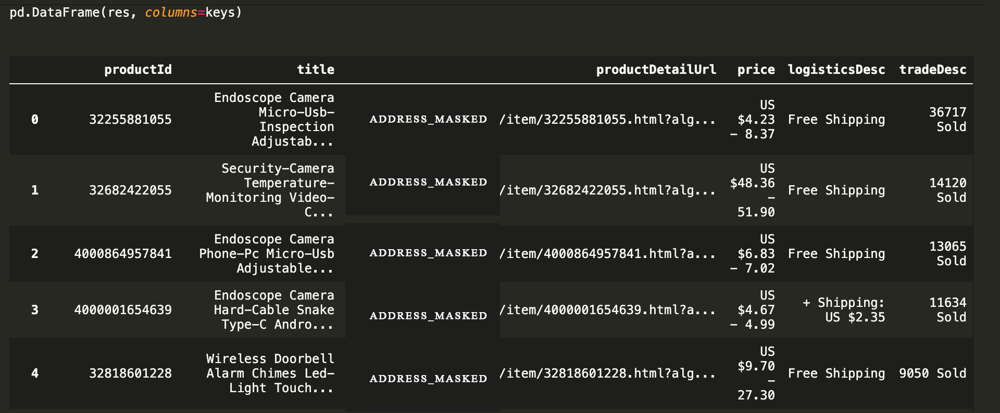

# E-Commercial_Crawler
This is a simple crawler script which can retreive items' name, price, solds and shipping cost.

## Problems
* When using *requests.request*, this will lead to a verification after 10-15 visitings
* Verification include slider verification, verification code to your email, etc.
* Changing headers, referers in pyppeteer or selenium can not pass this verification

## Solutions
* Visit the glosearch/api url, which returns a json file contains all the items info, instead of the original url
* This website will not block the frequent request from same session 
* Use *requests.session* which successfully avoid the verification
* If the session stops and a new session started the very same cookies will lead to a tricky verification, so change cookies everytime you run the get_sell_info func

## Samples Result

