# Selenium Tutorial - Auto Searching 

*A simple and straight forward introduction to Selenium*
*I am using Chrome driver*

- [Selenium Tutorial - Auto Searching](#selenium-tutorial---auto-searching)
  * [0. Introduction](#0-introduction)
  * [1. Installation](#1-installation)
  * [2. Create Target Websites And Launch Chrome Driver](#2-create-target-websites-and-launch-chrome-driver)
  * [3. First Website](#3-first-website)
    + [3.1 Searching](#31-searching)
    + [3.2 Extracting Information - BeautifulSoup](#32-extracting-information---beautifulsoup)
    
## 0. Introduction
This is a simple auto-searching task, after this tutorial, you will learn how to write a python code to search your target companies on some public website (e.g.: China Banking Regulatory Commission) and save the title and abstract of the result to Excel. Here is a list of our target website. I will use first three websites for demonstration and leave the rest of them for practise.

```
[01] https://www.creditchina.gov.cn
[02] http://www.gsxt.gov.cn
[03] http://www.chinatax.gov.cn
[04] http://www.chinasafety.gov.cn
[05] http://www.mee.gov.cn
[06] http://www.miit.gov.cn
[07] http://www.safe.gov.cn
[08] http://www.ndrc.gov.cn
[09] http://www.pbc.gov.cn
[10] http://www.cbrc.gov.cn
[11] http://www.samr.gov.cn
[12] http://www.stats.gov.cn
[13] http://www.nea.gov.cn
[14] http://www.mof.gov.cn
[15] http://www.ccgp.gov.cn
[16] http://www.moa.gov.cn
[17] http://credit.customs.gov.cn
[18] http://jzsc.mohurd.gov.cn
```

## 1. Installation
Step 1.1: Open your Chrome and find ***Settings***.
<p align="middle">
  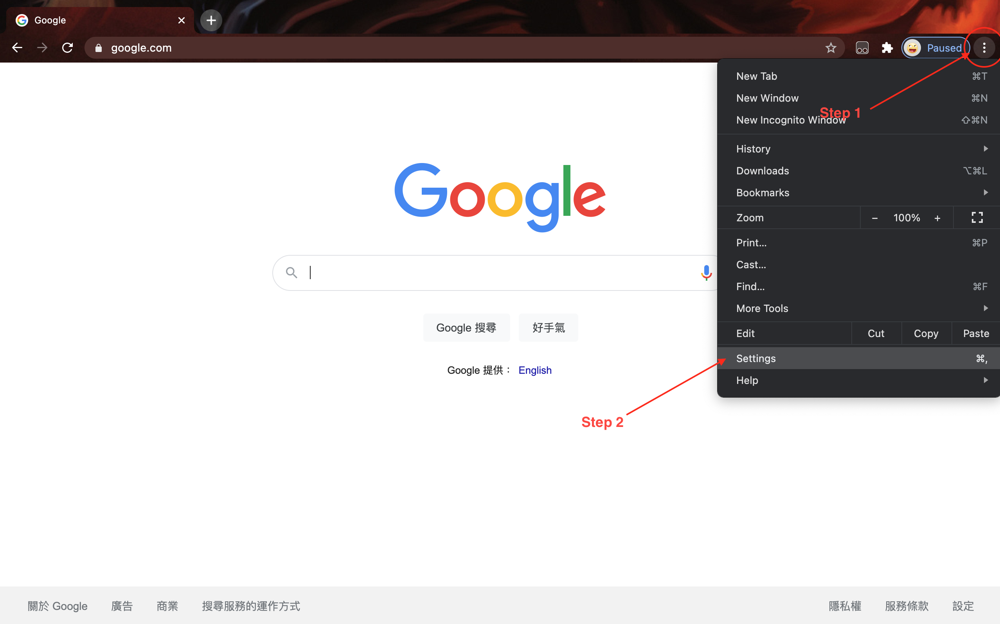
</p>

Step 1.2: Click ***Abour Chrome*** and you will see your Chrome Version.
<p align="middle">
  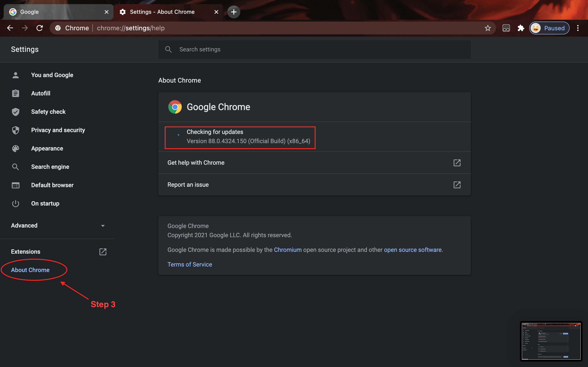
</p>

As you can see, I am using Chrome version 88.

Step 1.3: Go to [HERE](https://chromedriver.chromium.org/downloads) to download the right chrome driver and unzip it.
<p align="middle">
  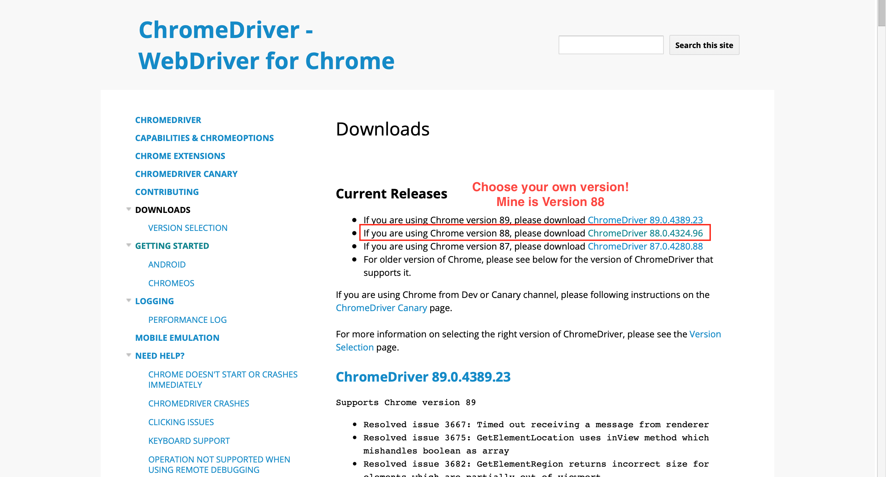
  
  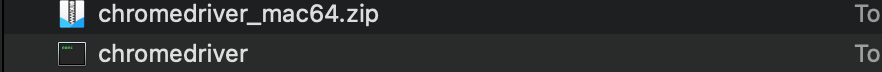
</p>

Step 1.4: Install Some Required Package in Python.
```
pip install selenium
pip install beautifulsoup4
```

## 2. Create Target Websites And Launch Chrome Driver
First we construct a diction to store our target website and their names.
```
target_websites=[
                {'name':'国家税务总局网站','url':'http://www.chinatax.gov.cn'},
                {'name':'信用中国网站','url':'https://www.creditchina.gov.cn'},
                {'name':'国家企业信用信息公示系统','url':'http://www.gsxt.gov.cn'},
                {'name':'中华人民共和国应急管理部网站','url':'http://www.chinasafety.gov.cn'},
                {'name':'中华人民共和国生态环境部网站','url':'http://www.mee.gov.cn'},
                {'name':'国家工信部网站','url':'http://www.miit.gov.cn'},
                {'name':'国家外汇管理局网站','url':'http://www.safe.gov.cn'},
                {'name':'国家发改委网站','url':'http://www.ndrc.gov.cn'},
                {'name':'中国人民银行网站','url':'http://www.pbc.gov.cn'},
                {'name':'中国银行保险监督管理委员会','url':'http://www.cbrc.gov.cn'},
                {'name':'国家市场监督管理总局网站','url':'http://www.samr.gov.cn'},
                {'name':'国家统计局网站','url':'http://www.stats.gov.cn'},
                {'name':'国家能源局网站','url':'http://www.nea.gov.cn'},
                {'name':'国家财政部网站','url':'http://www.mof.gov.cn'},
                {'name':'中国政府采购网','url':'http://www.ccgp.gov.cn'},
                {'name':'国家农业农村部网站','url':'http://www.moa.gov.cn'},
                {'name':'海关总署网站中国海关企业进出口信用信息公示平台','url':'http://credit.customs.gov.cn'},
                {'name':'全国建筑市场监管公共服务平台','url':'http://jzsc.mohurd.gov.cn'},
                ]

```

Then a diction for our target companies.
```
target_companies=['伊利',       # A famous Chinese Milk Product Company
                  '腾讯',       # Chinese Name of Tencent Technology
                  '阿里巴巴',    # Chinese Name of Alibaba
                  ]          
```

Next, we use the following command to open a python-controlled Chrome Driver.
Attention: you need to change ___YOUR_chormdriver_PATH___ to your own path!
```
from selenium import webdriver
driver = webdriver.Chrome('YOUR_chormdriver_PATH') 
```
Now you should have a empty Chrome window which looks like this.

<p align="middle">
  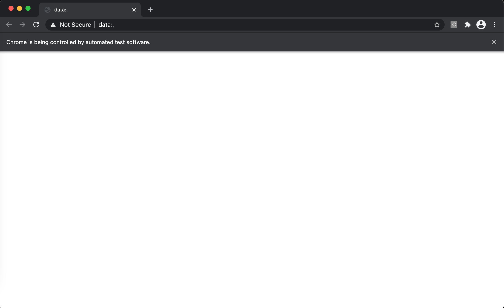
</p>

## 3. First Website
### 3.1 Searching
Now we search our first company on the first website.
First we mannully search it to see what does the website look like.
<p align="middle">
  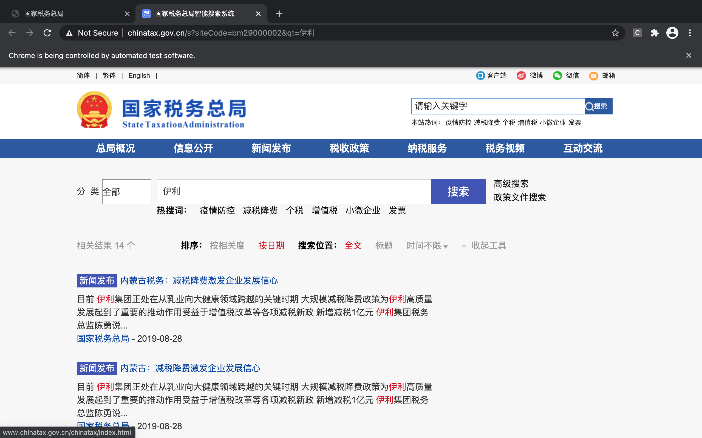
</p>

We can see that the url for this page is: http://www.chinatax.gov.cn/s?siteCode=bm29000002&qt=伊利, the content we search for is following the *qt=*. Thus, we can search for any content by simply replace the content after *qt=*.

For example, we want to search for 阿里巴巴, we set our target_company to 阿里巴巴. Then tell Chrome driver to visit the page.

```
target_company = '阿里巴巴'
url='http://www.chinatax.gov.cn/s?siteCode=bm29000002&qt='+target_company # we construct the url by adding our target company name after qt=
driver.get(url)     # this command tell the Chrome driver to visit this url
temp_results=driver.page_source # this will return the page source which will be useful for extracting the content we want.
```
After running the above code, we can see that the Chrome driver successfully searched the content for us!
<p align="middle">
  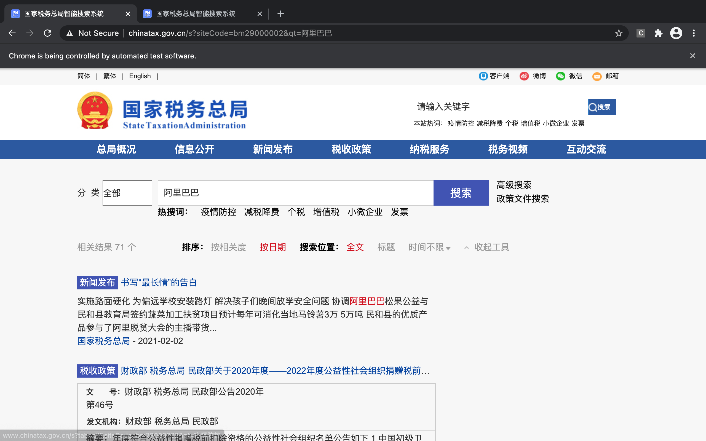
</p>

### 3.2 Extracting Information - BeautifulSoup
First we right click on the page and select *Inspect* to inspect the element on this page.
<p align="middle">
  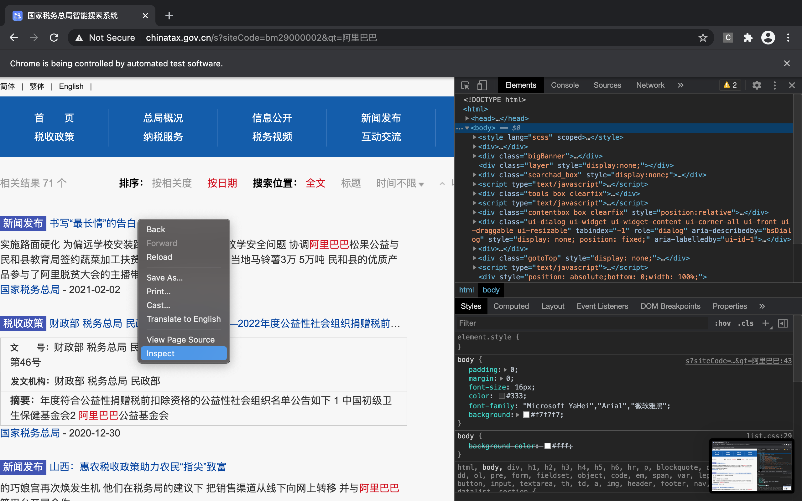
</p>

Then we *Inspect* again, this time we right click the title we want to save, for example, here I right click on the first result 书写“最长情”的告白.
<p align="middle">
  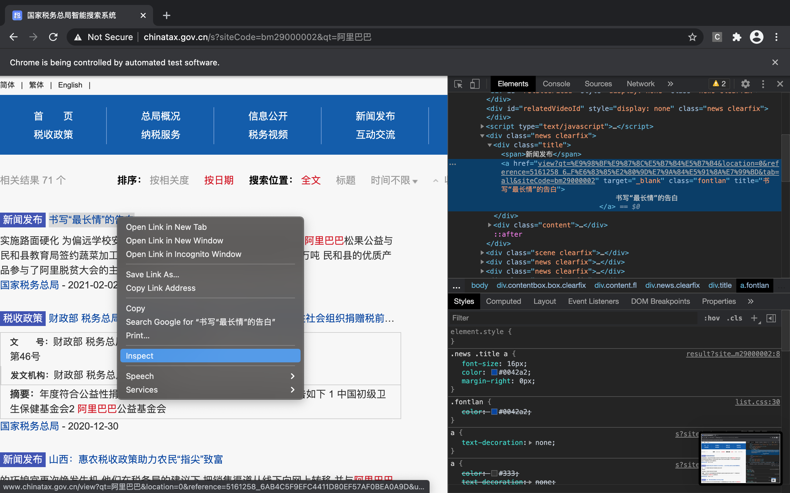
</p>

This time, we will find the element change to the part we selected. 

Put the cursor on each line of the element, it will highlight the corresponding content on the website. 

<p align="middle">
  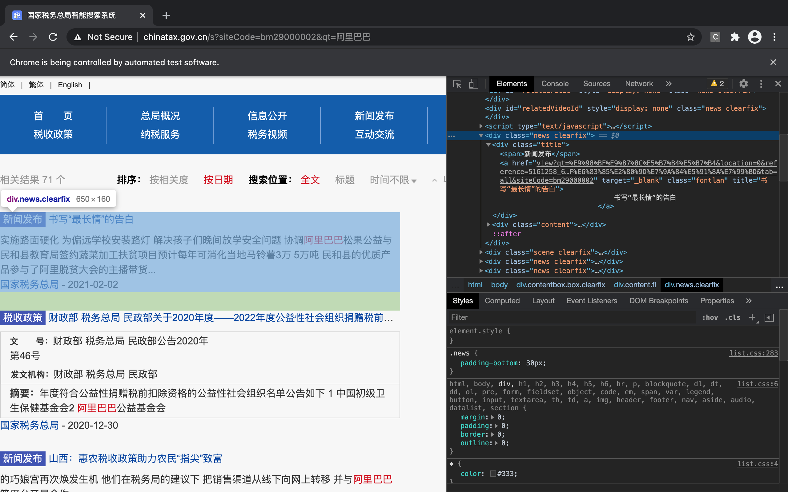
</p>

We can folded each group of element and find out that each 
```
<div class="news clearfix">
```
refer to one search result.

<p align="middle">
  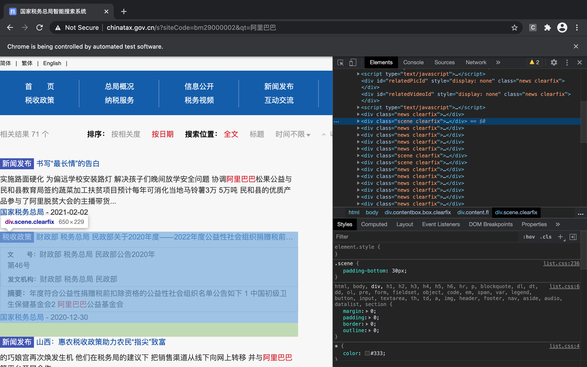
</p>

Now, we need to use *BeautifulSoup* to locate these element. 

BeautifulSoup locate element by name and class. You can specify one of both of them, it's up to you.

In this case, *div* is the name and both *news* and *clearfix* are class name, we can use class equal to either of *news* and *clearfix* to locate them.

We can see that the first class can be either *news* or *scene* but the second class always is *clearfix*, so we will use *clearfix* to identify them.
```
from bs4 import BeautifulSoup # import BeautifulSoup
temp_results=BeautifulSoup(temp_results)  # tell BeautifulSoup that we want to analyze temp_results
temp_results=temp_results.find_all('div',attrs={'class':'clearfix'})  # tell BeautifulSoup that we want to find all element 
                                                                      # who has 'div' as its name and 'clearfix' as its class
```
After we ran the above code, we will have 42 elements and the first and last few of the elements is not search result and we want to get rid of them.

<p align="middle">
  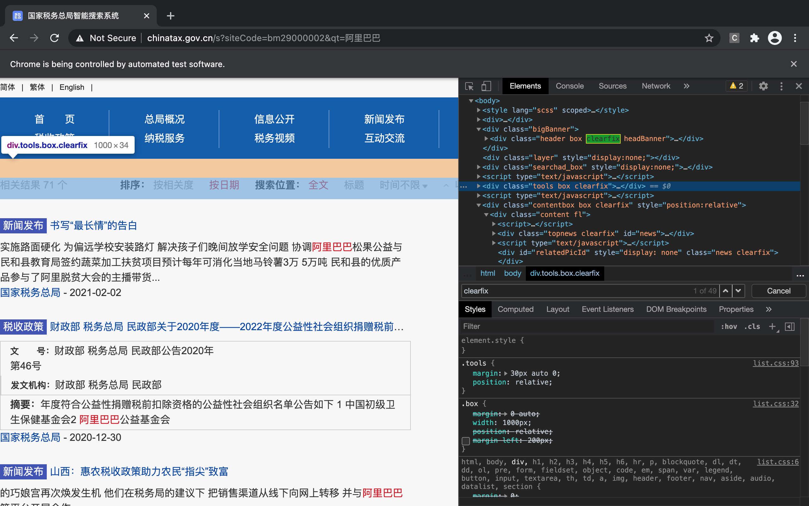
</p>

How can we do it? Let's figure it out later. Now we go back to our first search result and find out which component of the element contains the title.

We can see that for each
```
<div class="news clearfix">
```
It contains two children elements, 
```
<div class="title">
<div class="content">
```
And our title is in its first child element with *title* as its class, and abstract in the second child element with *txt* as its class.

The following command can help us abstract the title and abstract from it.
```
temp_result = temp_results[10]  # we choose the 10th result, because the first couple of results are not the ones we want.

# Here is what the result looks like.
"""
<div class="news clearfix">
<div class="title">
<span>新闻发布</span>
<a class="fontlan" href="view?qt=%E9%98%BF%E9%87%8C%E5%B7%B4%E5%B7%B4&amp;location=0&amp;reference=5161258_6AB4C5F9EFC4411D80EF57AF0BEA0A9D&amp;url=816D9628B2B6451D13E3EC07F12A5AA7829032E95B0C5C374F40950CD91B6E68156746C47BC9633FDE8607FBB7A8A1447D615CFBA67C37CB424CDC4665502783F73D08340E94CA3A9CABB1EEF64DD86E1EB5F61E9F7697166E5833E95ACFB8C8&amp;title=%E4%B9%A6%E5%86%99%E2%80%9C%E6%9C%80%E9%95%BF%E6%83%85%E2%80%9D%E7%9A%84%E5%91%8A%E7%99%BD&amp;tab=all&amp;siteCode=bm29000002" target="_blank" title="书写“最长情”的告白">
                            书写“最长情”的告白
                        </a>
</div>
<div class="content">
<div class="txt">
                                实施路面硬化 为偏远学校安装路灯 解决孩子们晚间放学安全问题 协调<em>阿里巴巴</em>松果公益与民和县教育局签约蔬菜加工扶贫项目预计每年可消化当地马铃薯3万 5万吨 民和县的优质产品参与了阿里脱贫大会的主播带货...
                            </div>
<div>
<a class="fontlan" href="view?qt=%E9%98%BF%E9%87%8C%E5%B7%B4%E5%B7%B4&amp;location=0&amp;reference=5161258_6AB4C5F9EFC4411D80EF57AF0BEA0A9D&amp;url=816D9628B2B6451D13E3EC07F12A5AA7829032E95B0C5C374F40950CD91B6E68156746C47BC9633FDE8607FBB7A8A1447D615CFBA67C37CB424CDC4665502783F73D08340E94CA3A9CABB1EEF64DD86E1EB5F61E9F7697166E5833E95ACFB8C8&amp;title=%E4%B9%A6%E5%86%99%E2%80%9C%E6%9C%80%E9%95%BF%E6%83%85%E2%80%9D%E7%9A%84%E5%91%8A%E7%99%BD&amp;tab=all&amp;siteCode=bm29000002" target="_blank"> 国家税务总局</a>
                                    - 2021-02-02
                            </div>
</div>
</div>
"""
```
Now, its time to make this crazy text into human language.
```
title_element = temp_result.find(attrs={'title':True}) # this one find the first element in the above element that contains *title*
title = title_element.get('title')  # this will extract the title from the title_element

abstract_element = temp_result.find(attrs={'class':'txt'}) # locate the first child element whose class is txt
abstract = abstract_element.get_text() # this will return the text of this element, which is exactly what we want
abstract = abstract.strip()   # the above result contains many empty space, we can use this line to drop those space
```

Finally! Remember those element we don't want? Now its time to skip them. To do so, we need use a new method *try* and *except*.

These commands can be useful when you don't know if your code will have an error. Remember only the search results have those two children elements and if you try to acess the *title_element* of a irrelevant element, it will cause an error, so we can use *try* and *except* to skip irrelevant elements.

```
result=[] # first we create a empty list to store the result
for temp_result in temp_results:  # loop for everyt result
    try:
        title_element = temp_result.find(attrs={'title':True})
        title = title_element.get('title')

        abstract_element = temp_result.find(attrs={'class':'txt'})
        abstract = abstract_element.get_text()
        abstract = abstract.strip()
        
        result.append([title,abstract])
    except:   # if there is an error, we do nothing
        pass
```
Now you should have the result list which looks like this:

<p align="middle">
  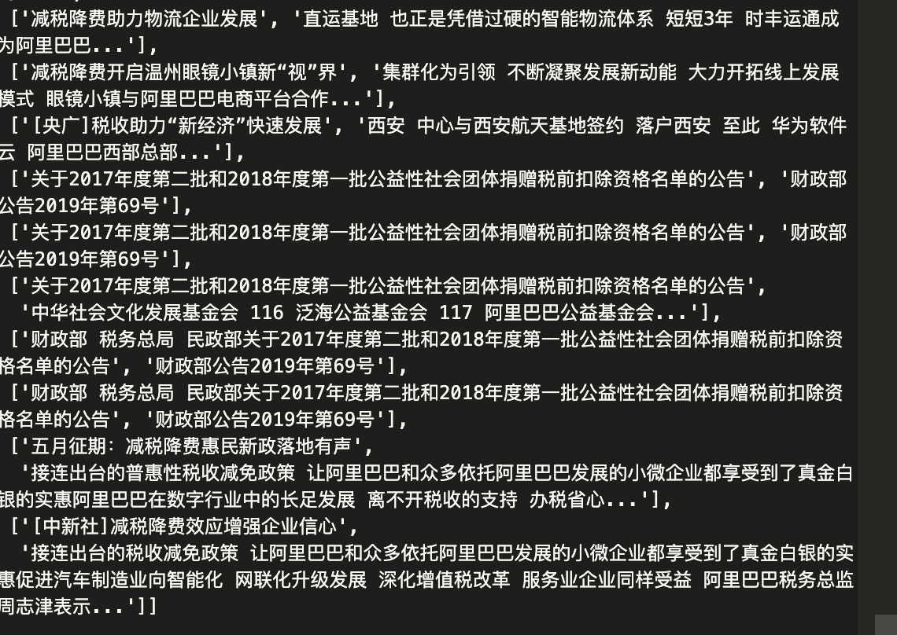
</p>
Next thing we need to do is to save the data into a Excel file:
```
result = pd.DataFrame(result,columns=['title','abstract'])  # we create a dataframe based on our result, the first column is title and the second one is abstract.
result.to_csv('result.csv') # we save it as an Excel file
```

The result looks like this:

<p align="middle">
  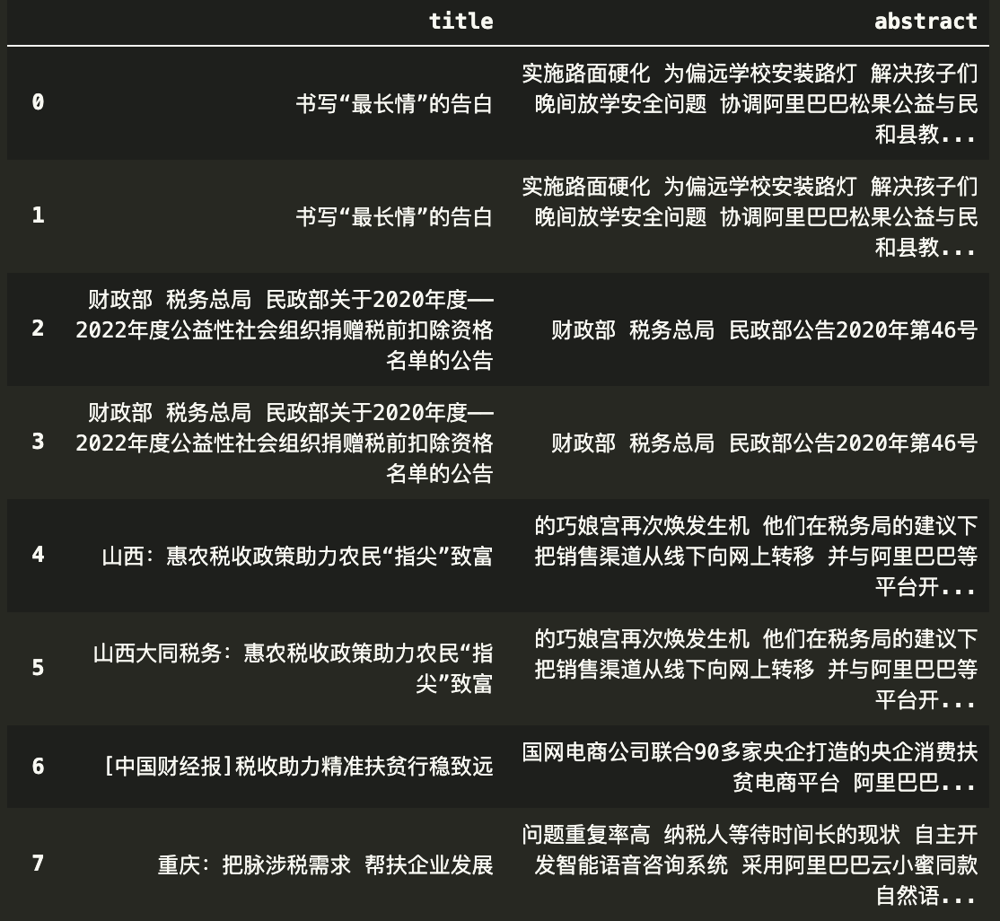
</p>
